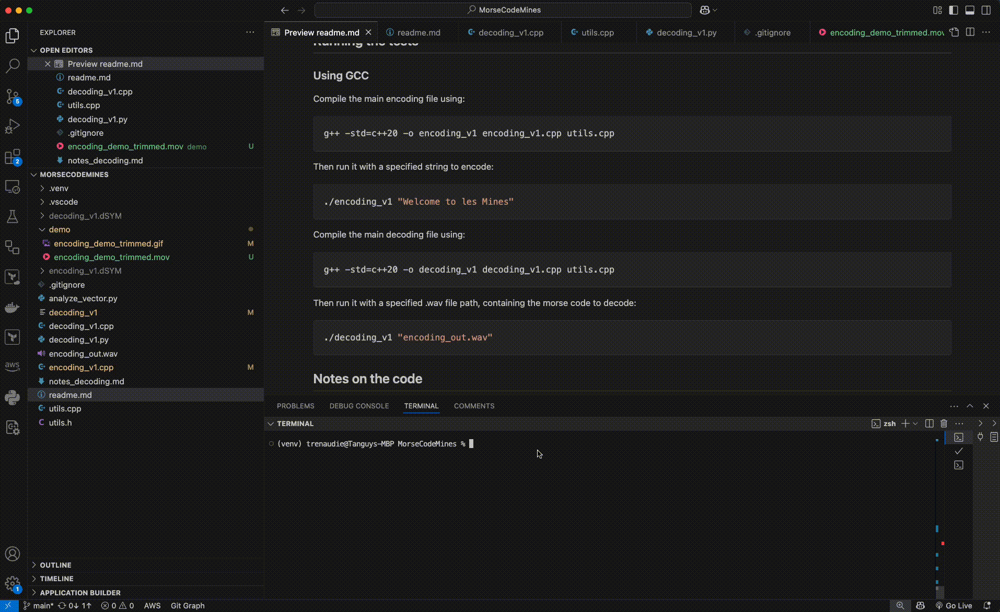

# Morse Code Mines

This is the final assignment for the Mines Paris C++ Athens Course.
The goal of this repository is to provide C++ code for encoding and decoding Morse Code, from/to English text.

## Examples

We provide the following examples:

- Encoding a sample Latin-alphabet string of words such as "Hello World" and saving it to disk as a .WAV file.  
  Video located at `demo/encoding_demo.mov`
    


- Decoding a morse code, saved locally in a .WAV file, into a Latin-alphabet string of words.  
  Video located at `demo/decoding_demo.mov`
    


## Running the tests

### Using GCC

Compile the main encoding file using:
```bash
g++ -std=c++20 -o encoding_v1 encoding_v1.cpp utils.cpp
```

Then run it with a specified string to encode:
```bash
./encoding_v1 "Welcome to les Mines"
```

Compile the main decoding file using:
```bash
g++ -std=c++20 -o decoding_v1 decoding_v1.cpp utils.cpp
```

Then run it with a specified .wav file path, containing the morse code to decode:
```bash
./decoding_v1 "encoding_out.wav"
```

## Notes on the code

### Decoding script

This script is more complicated. 

A Morse code encoding is a sequence containing 4 different characters:
- The dot
- The dash
- The space between letters
- The space between words

For an audio file, we must add a 5th character:
- The space between beeps of the audio file, to delimit them.

The usual ratios for the length of each character are the following:
- The dot: 1
- The dash: 3
- The space between beeps: 1
- The space between letters: 3 (or 4)
- The space between words: 7

Therefore, given an audio file with its specific sample rate and character lengths, we must:
1. Open and read the wav file into amplitude values
2. Measure the durations of each ON/OFF segment
3. Determine the ratio chosen by the encoder, before translating the beeps into their characters.

**1. Reading the WAV file**

The header takes 44 characters
file.read() takes as input a pointer to char, so we must use the address-of operator 
`&header[0]`. 
The raw file contents look like this 
```
RIFF�WAVEfmt D��Xdata�+Lv��"i�X�Y��L��Bj����[(��5�I�%�L�}�������%�B�b�������#�l���*��+���~�H�*�%�:�i����.�������������h���<���A�e��(  �
=
$�����W�.bnS�
RIFF�WAVEfmt D��Xdata�+Lv��"i�X�Y��L��Bj����[(��5�I�%�L�}�������%�B�b�������#�l���*��+���~�H�*�%�:�i����.�������������h���<���A�e��( �
=
$�����W�.bnS�
```
This is obviously not encoded as a string, but as binary data (01101000 00011011 etc ), where each pair of 2 bytes corresponds to an audio sample.
We must convert these 2 byte pairs into their float values, hence the code 
```cpp
short value = *(short*)buffer;
float normalized = value / 32768.0f;
```

**Measuring ON/OFF durations**

To accurately measure the durations of each ON/OFF segment of the audio file, we used a threshold of 20 wavelengths minimum of OFF signal, to label the segment as OFF. This allowed us to maintain the segment's as ON in the case of a sinusoidal signal where some points have low amplitudes. 
To determine the duration of a wavelength, we adapted a simple DFT algorithm. We assumed in doing so that the signal was a simple sinusoidal signal.

**Determining Beep Ratios**

We sort the segment durations into 3 categories using a simple rounding arithmetic (kmeans clustering was attempted, but deemed too complex for this task).
Category 1 : short beeps - the dot and the space between beeps 
Category 2 : medium sized beeps - the space between letters and the dash 
Category 3 : long beeps - the space between words